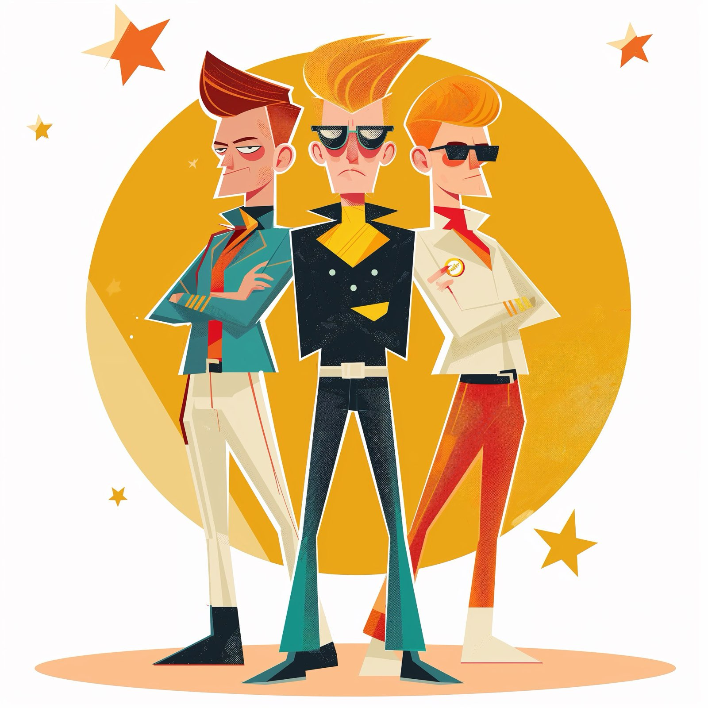

# Assignment 1: Enhance CrewAI for Autonomous Research

## Recap of Last Week’s Assignment 1

Last week, I initiated the development of a concept for a multi-agent company capable of dynamically creating teams for various tasks. This transition from fixed task assignments to a flexible and scalable model allows my agents to adapt and form teams based on ongoing project needs, marking a significant step towards autonomous operational capabilities.

## New Agent Structure Overview

### Major Tom: Command Center

- **Role**: Acts as the primary interface for high-level directives and updates, orchestrating the flow of information across the virtual company.
- **Inspiration**: Inspired by David Bowie’s "Space Oddity," Major Tom symbolizes the crucial connection between command and the operational forefront. For a fun reference, check out Peter Schilling's continuation of this theme in ["Major Tom (Coming Home)"](https://www.youtube.com/watch?v=wO0A0XcWy88).

### Ziggy Stardust: Crew Architect

- **Role**: Charged with the creative assembly of specialized teams tailored to meet the diverse challenges the company faces.
- **Inspiration**: Named after Bowie's iconic alter ego, Ziggy Stardust embodies the innovative and charismatic qualities needed to lead and inspire dynamic teams. Dive into Ziggy's world with ["Ziggy Stardust (2012 Remaster)"](https://www.youtube.com/watch?v=7KEn0uOEILs).

### Starman: Strategic Navigator

- **Role**: Ensures that every project and task aligns with the company’s long-term visions and immediate goals.
- **Inspiration**: Drawing from Bowie’s "Starman," this role acts as a guiding light, directing the strategic path and ensuring adherence to the core mission. Experience the inspiration through ["Starman (2012 Remaster)"](https://www.youtube.com/watch?v=aBKEt3MhNMM).

These roles were designed to enable more autonomous task execution, with a system that adapts and evolves according to project dynamics. 

## Infinity Crew: Boundless Possibilities

The structure of my Infinity Crew encapsulates the limitless potential of the team, ensuring endless innovation in operational strategy and execution.

### Major Tom: Command Center
- **Role**: Serves as the central hub for all high-level directives and updates, orchestrating the flow of communication across the company.
- **Why Major Tom**: Inspired by "Space Oddity," Major Tom represents the vital connection between distant command and operational forefront, acting as a crucial decision-maker within my enterprise.

### Ziggy Stardust: Crew Architect
- **Role**: Evaluates the strengths and needs of each mission, forming dynamic crews that can best tackle the diverse challenges.
- **Why Ziggy Stardust**: Represents innovation and charisma, leveraging these traits to craft teams that are synergistic and inspired.

### Starman: Strategic Navigator
- **Role**: Provides strategic guidance, ensuring that every project contributes to the overarching objectives of the company.
- **Why Starman**: Named after the song that speaks of a messenger bringing hope, Starman ensures that my company's journey is always headed in the right direction, innovative yet grounded in core missions.

This team structure combines practical functionality with creative titles, reflecting the innovative spirit of David Bowie while being anchored in the realities of business management and strategic development.

For the Python code that runs the CrewAI for the Infinity Crew, see [infinity_crew.py](infinity_crew.py).
