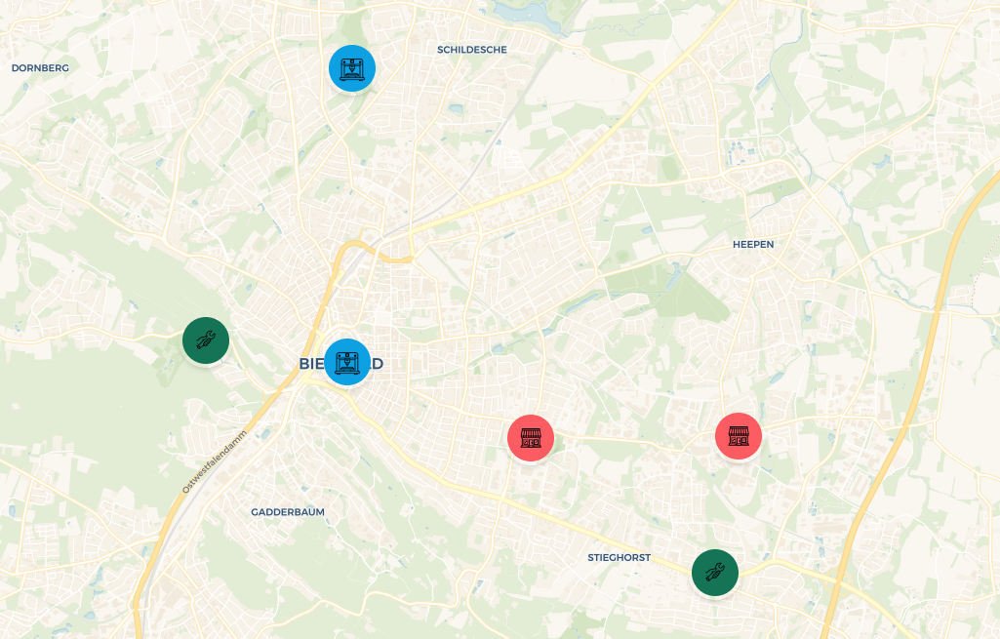

# Local Manufacturing Networks Interactive Map

## Progress Update

### Developed Interactive Map

The interactive map has been developed using the Next.js framework, specifically leveraging the `leaflet-nextjs-ts-starter` template by Richard Unterberg. This choice provides a robust foundation for the integration of mapping functionalities.

### Custom Icons

To enhance map readability and aesthetics, custom icons have been created for various entities such as Digital Manufacturing Facilities, Assemblers, and Local Businesses. These icons were crafted using AI tools like Midjourney and DALL·E 3 and have been integrated into the application as React components.

#### Icon Integration Process

- **Convert Icons to SVG Format:**  
  The initial step involves converting icon images (in formats such as PNG, JPEG, or WebP) into SVG format using a free online tool, accessible [here](https://convertio.co/png-svg/). SVG is preferred for its scalability and quality retention across different display sizes.

- **Optimize SVG Files:**  
  Post conversion, the SVG files are optimized to reduce file size while maintaining image quality, which is essential for web application performance. Optimization is performed using the SVGOMG tool, available [here](https://jakearchibald.github.io/svgomg/).

- **Convert SVGs to React Components:**  
  The optimized SVG files are then converted into React components to integrate seamlessly with the application's React architecture. This step is accomplished using the SVGR Playground, found [here](https://react-svgr.com/playground/).

These steps ensure that the custom icons not only enhance the visual appeal of the application but also conform to modern web standards and practices.

## Next Immediate Steps

- **Deploy**: Immediate deployment of the application on Vercel is planned to ensure ease of access and to maintain high availability.
- **Sidebar Functionality**: We will add functionality to toggle the sidebar, thus improving the user interface.
- **API Integration**: The Overpass API will be integrated to import detailed geospatial data from OpenStreetMap, enhancing the map's utility with accurate, real-time data.
- **Populate Data**: The next phase involves populating the map with real-world data to make the information provided both accurate and practical for users.
- **Business Interaction**: New features will be introduced to allow businesses to claim their listings on the map and detail their digital manufacturing services.
